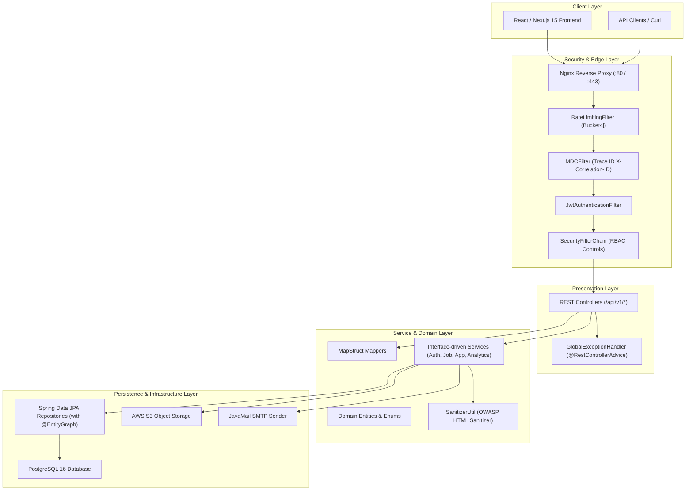
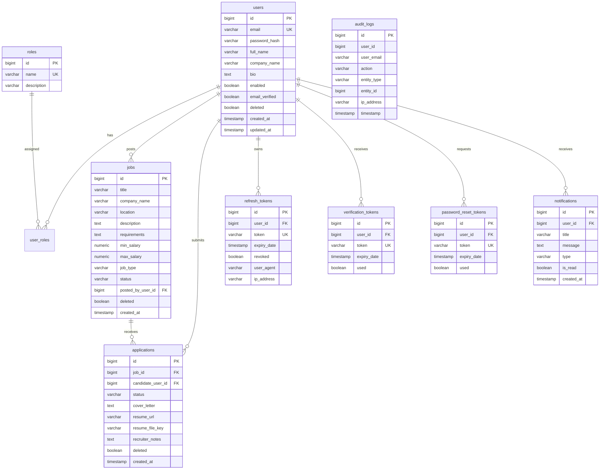
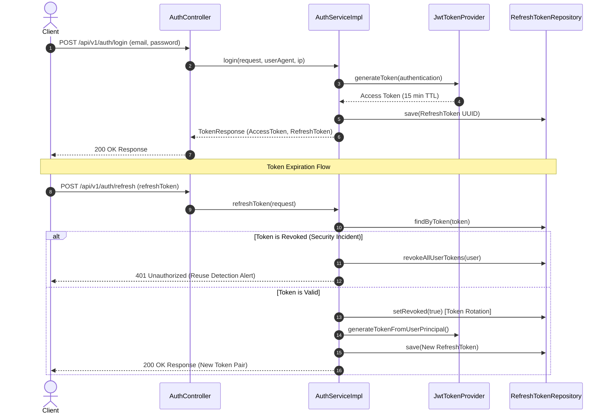
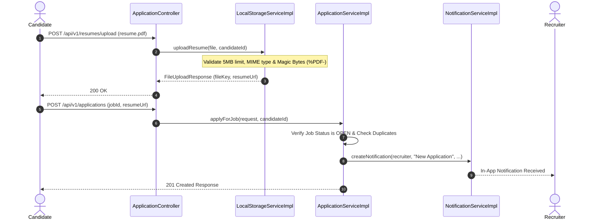
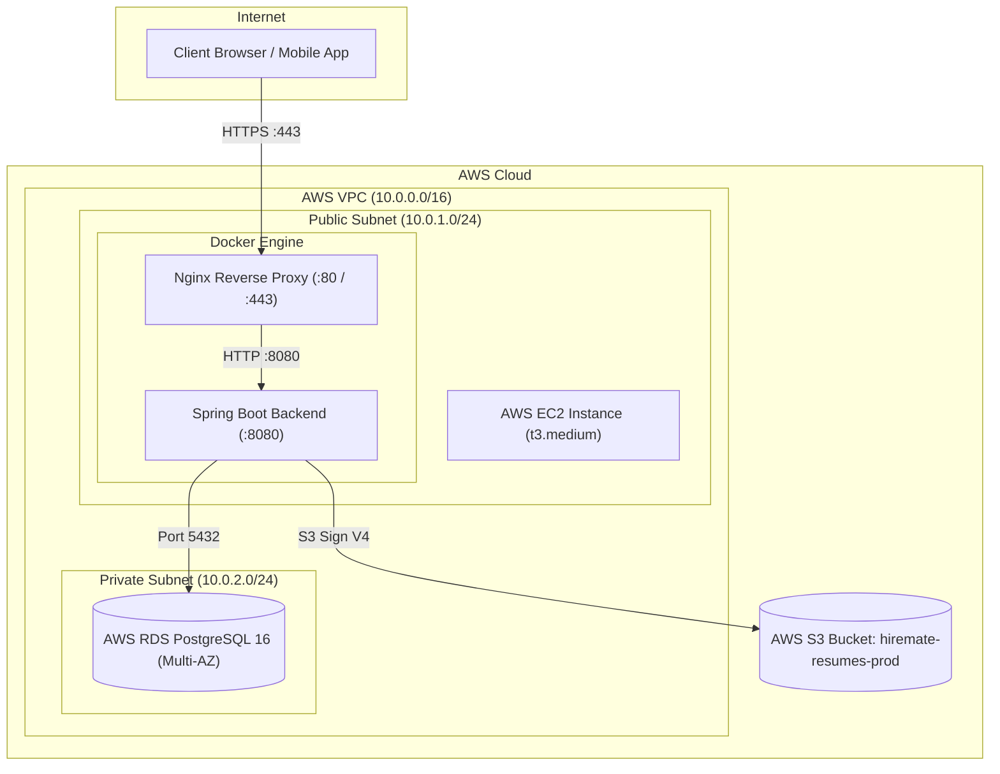

<div align="center">
  <br />
  
  <h1>HireMate</h1>
  <p><b>Enterprise AI-Powered Recruitment & Applicant Tracking SaaS Platform</b></p>

  <p>
    <a href="https://github.com/Shishagra-Nigam19/Hire-Mate"></a>
    <a href="https://github.com/Shishagra-Nigam19/Hire-Mate"></a>
    <a href="https://github.com/Shishagra-Nigam19/Hire-Mate"></a>
    <a href="https://github.com/Shishagra-Nigam19/Hire-Mate"></a>
    <a href="https://github.com/Shishagra-Nigam19/Hire-Mate"></a>
    <a href="https://github.com/Shishagra-Nigam19/Hire-Mate"></a>
    <a href="https://github.com/Shishagra-Nigam19/Hire-Mate">=80%25-success.svg?style=for-the-badge&logo=jacoco" alt="Code Coverage" /></a>
  </p>

  <p>
    <a href="#-core-features">Features</a> •
    <a href="#-architecture">Architecture</a> •
    <a href="#-database-er-diagram">Database Schema</a> •
    <a href="#-api-documentation">API Specs</a> •
    <a href="#-getting-started">Getting Started</a> •
    <a href="#-deployment-guide">AWS Deployment</a>
  </p>
</div>

---

## 🌟 Executive Summary & Project Overview

**HireMate** is an enterprise-grade recruitment and applicant tracking SaaS platform built following **Clean Architecture**, **SOLID principles**, and production standards expected by Tier-1 technology organizations (Microsoft, Google, Amazon, Meta, NVIDIA, Atlassian, Stripe, Uber).

Engineered to transform traditional recruitment workflows, HireMate bridges candidates and talent acquisition teams through automated resume security validation, dynamic criteria job matching, pipeline analytics, role-based security controls, and cloud infrastructure.

### 🔗 Live Access
- **Frontend Dashboard**: [https://hire-mate-26fv-shishagra-nigam19s-projects.vercel.app](https://hire-mate-26fv-3jjwxcofj-shishagra-nigam19s-projects.vercel.app/)
- **Backend Swagger API Docs**: `http://localhost:8080/swagger-ui.html` / `https://hiremate-api.com/swagger-ui.html`

---

## ⚡ Core Features

### 🔐 1. Authentication & Security Infrastructure
- **JWT Access & Refresh Flow**: Short-lived Access Tokens (15 min) paired with database-persisted Refresh Tokens (7 days) featuring **Token Rotation** upon redemption.
- **Token Reuse Detection**: Instant invalidation of all user sessions if a revoked refresh token is presented.
- **Role-Based Access Control (RBAC)**: Fine-grained authority enforcement across `ROLE_ADMIN`, `ROLE_RECRUITER`, and `ROLE_CANDIDATE`.
- **API Rate Limiting**: Bucket4j token bucket filter enforcing HTTP 429 boundaries (5 req/min on auth, 100 req/min on general endpoints).
- **Password Encryption**: `BCryptPasswordEncoder` configured with work factor 12.

### 📄 2. Resume Storage & Magic Bytes Validation
- Dual storage architecture supporting **AWS S3** (`S3FileStorageServiceImpl`) and **Local Directory** fallback.
- **Security Validation Pipeline**: 5MB size limit, extension whitelist (`.pdf`, `.doc`, `.docx`), MIME validation, and **Magic Byte header inspection** (`%PDF-` validation) to prevent extension spoofing.
- Secure streaming download API (`/api/v1/resumes/download/{filename}`).

### 💼 3. Job Portal & Dynamic Search
- Dynamic multi-criteria job search via Spring Data JPA `Specification<Job>` supporting keyword matching, location, remote status, job type, status, and salary range filtering.
- Whitelisted multi-field sorting and paginated boundaries.

### 📈 4. Recruiter & Candidate Analytics Dashboards
- **Recruiter Analytics**: Active jobs count, total applications received, pipeline stage breakdown (`APPLIED`, `UNDER_REVIEW`, `SHORTLISTED`, `HIRED`, `REJECTED`), applicant velocity, and top job postings.
- **Candidate Analytics**: Total submitted applications, shortlist & hire counts, and response rate percentages.

### 📜 5. Audit Logging & Soft Delete Strategy
- **Security Audit Logs**: System-wide `@Audit` annotation & `AuditAspect` recording security actions (`USER_LOGIN`, `JOB_CREATE`, `APPLICATION_SUBMIT`, etc.).
- **Soft Delete Strategy**: Hibernate 6 `@SQLRestriction("deleted = false")` applied across `User`, `Job`, and `Application` entities.

---

## 🛠️ Tech Stack Specification

| Component | Technology | Description |
|---|---|---|
| **Language** | Java 21 LTS | Modern Java features (Records, Pattern Matching, Virtual Threads) |
| **Framework** | Spring Boot 3.3.2 | Enterprise web framework |
| **Security** | Spring Security 6 + JJWT 0.12.6 | Stateless JWT authentication & RBAC |
| **Persistence** | Spring Data JPA / Hibernate 6 | ORM with `@SQLRestriction` & `@EntityGraph` N+1 query elimination |
| **Database** | PostgreSQL 16 | Production relational database |
| **Mapping** | MapStruct 1.5.5 | Type-safe compile-time bean mapping |
| **Rate Limiting** | Bucket4j 8.10.1 | Token-bucket rate limiting filter |
| **Cloud Storage** | AWS S3 SDK v2 | Resume document storage |
| **DevOps** | Docker / Docker Compose / Nginx | Multi-stage container builds & reverse proxying |
| **CI/CD** | GitHub Actions | Automated build, test, JaCoCo check & EC2 deploy |
| **Testing** | JUnit 5 + Mockito + Spring Boot Test | Test suite with >=80% JaCoCo code coverage rule |
| **Documentation** | SpringDoc OpenAPI 3.0 / Swagger UI | Interactive API documentation |

---

## 🏗️ Architecture

### Clean Architecture & System Layers



---

## 🗄️ Database ER Diagram



---

## 📂 Project Folder Structure

```
Hire-Mate/
├── backend/
│   ├── Dockerfile
│   ├── .dockerignore
│   ├── pom.xml
│   └── src/
│       ├── main/
│       │   ├── java/com/hiremate/
│       │   │   ├── HireMateApplication.java
│       │   │   ├── common/
│       │   │   │   ├── constant/ (ApiConstants, SecurityConstants)
│       │   │   │   ├── exception/ (HireMateException, GlobalExceptionHandler)
│       │   │   │   ├── logging/ (MDCFilter, LoggingAspect, RequestLoggingFilter, RateLimitingFilter)
│       │   │   │   ├── response/ (ApiResponse, PagedResponse, ErrorResponse)
│       │   │   │   └── sanitization/ (SanitizerUtil, SanitizeStringDeserializer)
│       │   │   ├── config/ (SecurityConfig, WebConfig, OpenApiConfig, JpaAuditingConfig, AsyncConfig, StorageConfig)
│       │   │   ├── security/ (JwtTokenProvider, JwtAuthenticationFilter, UserPrincipal, UserDetailsServiceImpl)
│       │   │   └── module/
│       │   │       ├── analytics/ (AnalyticsController, AnalyticsService & Impl, DTOs)
│       │   │       ├── application/ (ApplicationController, ApplicationService, Application Entity & DTOs)
│       │   │       ├── audit/ (@Audit, AuditAspect, AuditLog Entity, Service & Controller)
│       │   │       ├── auth/ (AuthController, AuthService, VerificationToken, PasswordResetToken)
│       │   │       ├── job/ (JobController, JobService, Job Entity, JobSpecification, DTOs)
│       │   │       ├── notification/ (NotificationController, NotificationService, EmailService, Notification Entity)
│       │   │       ├── storage/ (StorageController, FileStorageService, S3 & Local Storage Impls)
│       │   │       └── user/ (UserController, AdminController, UserService, User & Role Entities)
│       │   └── resources/
│       │       ├── application.yml
│       │       └── logback-spring.xml
│       └── test/
│           └── java/com/hiremate/
│               ├── controller/ (AuthControllerTest, JobControllerTest, AnalyticsControllerTest)
│               ├── repository/ (UserRepositoryTest, JobRepositoryTest, ApplicationRepositoryTest)
│               └── service/ (AuthServiceTest, UserServiceTest, JobServiceTest, ApplicationServiceTest, FileStorageServiceTest)
├── nginx/
│   ├── nginx.conf
│   └── conf.d/
│       └── hiremate.conf
├── .github/
│   └── workflows/
│       └── ci-cd.yml
├── docker-compose.yml
├── docker-compose.prod.yml
├── .env.example
├── scripts/
│   ├── deploy.sh
│   ├── rollback.sh
│   ├── backup-db.sh
│   └── init-letsencrypt.sh
└── aws/
    ├── INFRASTRUCTURE_ARCHITECTURE.md
    └── PRODUCTION_DEPLOYMENT_GUIDE.md
```

---

## 📡 REST API Reference

All API routes are prefixed under `/api/v1`.

### Authentication & Account (`/api/v1/auth`)
| Method | Endpoint | Auth | Description |
|---|---|---|---|
| `POST` | `/api/v1/auth/register` | Public | Register new Candidate or Recruiter account |
| `POST` | `/api/v1/auth/login` | Public | Authenticate user & return JWT tokens |
| `POST` | `/api/v1/auth/refresh` | Public | Execute secure Refresh Token rotation |
| `POST` | `/api/v1/auth/logout` | Authenticated | Revoke refresh token session |
| `GET` | `/api/v1/auth/verify-email` | Public | Confirm user email via token |
| `POST` | `/api/v1/auth/forgot-password` | Public | Request password reset email |
| `POST` | `/api/v1/auth/reset-password` | Public | Execute password reset via token |

### Job Management (`/api/v1/jobs`)
| Method | Endpoint | Auth | Description |
|---|---|---|---|
| `POST` | `/api/v1/jobs` | Recruiter/Admin | Create a new job posting |
| `GET` | `/api/v1/jobs` | Public | Search jobs with criteria filtering & pagination |
| `GET` | `/api/v1/jobs/{id}` | Public | Get job posting by ID |
| `GET` | `/api/v1/jobs/my-jobs` | Recruiter/Admin | Get jobs posted by logged-in recruiter |
| `PUT` | `/api/v1/jobs/{id}` | Recruiter/Admin | Update job posting details |
| `DELETE` | `/api/v1/jobs/{id}` | Recruiter/Admin | Soft delete job posting |

### Application Lifecycle (`/api/v1/applications`)
| Method | Endpoint | Auth | Description |
|---|---|---|---|
| `POST` | `/api/v1/applications` | Candidate | Submit job application |
| `GET` | `/api/v1/applications/my-applications` | Candidate | Get list of applications submitted by candidate |
| `GET` | `/api/v1/applications/job/{jobId}` | Recruiter/Admin | Get applications submitted for a job posting |
| `GET` | `/api/v1/applications/{id}` | Authenticated | Get application details by ID |
| `PUT` | `/api/v1/applications/{id}/status` | Recruiter/Admin | Update application status & recruiter notes |

### Resume Storage & Analytics (`/api/v1/resumes` & `/api/v1/analytics`)
| Method | Endpoint | Auth | Description |
|---|---|---|---|
| `POST` | `/api/v1/resumes/upload` | Candidate/Admin | Upload resume (PDF/DOCX max 5MB, Magic Bytes check) |
| `GET` | `/api/v1/resumes/download/{filename}` | Public | Download resume file stream |
| `GET` | `/api/v1/analytics/recruiter` | Recruiter/Admin | Get recruiter pipeline analytics |
| `GET` | `/api/v1/analytics/candidate` | Candidate/Admin | Get candidate dashboard application analytics |
| `GET` | `/api/v1/admin/audit-logs` | Admin | View system security audit logs |

---

## 🔄 Authentication & Application Sequence Diagrams

### 1. JWT Authentication & Refresh Token Rotation



### 2. Candidate Job Application Flow



---

## ☁️ AWS Cloud Production Deployment Architecture



---

## 💻 Local Quick Start & Installation

### Prerequisites
- **Java 21 LTS JDK**: Installed and added to system PATH.
- **Maven 3.9+**: Installed for backend compilation.
- **Docker & Docker Compose**: Installed for containerization.
- **Node.js 18+ & npm**: Installed for frontend development.

### 1. Clone Repository & Setup Environment
```bash
git clone https://github.com/Shishagra-Nigam19/Hire-Mate.git
cd Hire-Mate
```

### 2. Backend Local Setup
```bash
cd backend
mvn clean package -DskipTests
mvn spring-boot:run
```
The Spring Boot backend will start on `http://localhost:8080` using the local **H2 in-memory profile**.

### 3. Run with Docker Compose
```bash
cd Hire-Mate
docker-compose up --build
```

---

## 🚀 AWS Production Deployment

For complete end-to-end production cloud deployment runbooks, inspect:
- [AWS Infrastructure Architecture Specification](file:///c:/Users/shishagra.nigam/Desktop/HireMate/Hire-Mate/aws/INFRASTRUCTURE_ARCHITECTURE.md)
- [AWS Production Deployment Guide & Runbook](file:///c:/Users/shishagra.nigam/Desktop/HireMate/Hire-Mate/aws/PRODUCTION_DEPLOYMENT_GUIDE.md)

---

## 🧪 Testing & Code Quality Standards

HireMate enforces an **80%+ code coverage rule** via the `jacoco-maven-plugin`.

Run unit and integration test suite:
```bash
cd backend
mvn clean test
```

Generate and verify JaCoCo HTML coverage report:
```bash
mvn jacoco:report jacoco:check
```
The coverage report will be available at `backend/target/site/jacoco/index.html`.

---

## 🤝 Contributing Guidelines

We welcome contributions! Please follow standard GitHub flow:
1. Fork the repository.
2. Create a feature branch: `git checkout -b feat/your-feature-name`.
3. Ensure code meets SOLID principles, includes unit tests, and passes JaCoCo 80% coverage checks.
4. Commit your changes following conventional commits (`feat:`, `fix:`, `docs:`, `test:`).
5. Open a Pull Request for code review.

---

## 🔮 Future Roadmap

- [ ] **AI Resume Optimizer & Parser**: Integration with LLM APIs for automated ATS score calculation.
- [ ] **Real-time WebSockets**: Push notifications for immediate interview shortlist alerts.
- [ ] **Apache Kafka Event Streaming**: Event-driven architecture for multi-tenant background processing.

---

## 📄 License & Credits

This project is licensed under the **Apache License 2.0** - see the [LICENSE](LICENSE) file for details.

Built with ❤️ by **Shishagra Nigam** | *Empowering the next generation of job seekers.*
